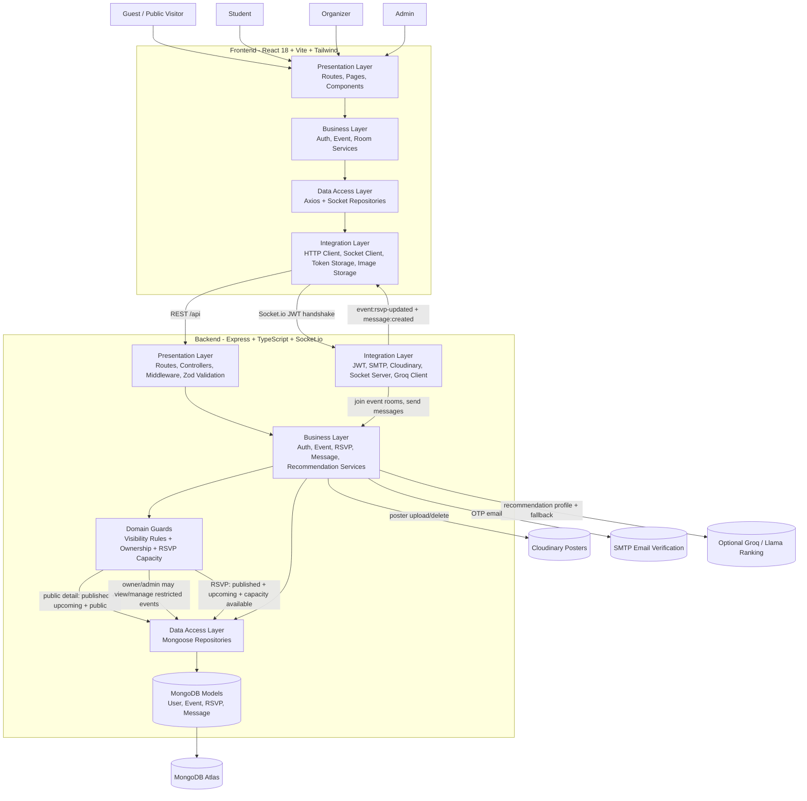

# EventSync Architecture

## Mermaid Diagram

## Layer Summary
- Presentation: pages, forms, controllers, routes, and middleware manage user input and HTTP/socket boundaries.
- Business Logic: services coordinate auth, event ownership, RSVP rules, and event-room messaging.
- Data Access: repositories isolate MongoDB queries and persistence details.
- Integration: third-party concerns such as MongoDB Atlas, Cloudinary, JWT, Axios, and Socket.io stay outside the business core.

## Real-Time Flow
1. A user opens `/events/:eventId` in the frontend.
2. Public visitors can view only event details that pass the backend visibility rule: published, upcoming, and public.
3. Authenticated users establish a JWT-authenticated Socket.io connection and join room `event:{eventId}`.
4. RSVP changes must pass backend guards for published/upcoming events and available capacity, then the backend emits `event:rsvp-updated`.
5. Chat messages flow through the socket server, are permission-checked, persisted by the message service, and broadcast as `message:created`.

## Recommendation Flow
1. The home feed builds a preference profile from a user's RSVP history.
2. Eligible candidate events are restricted to published, upcoming, public events.
3. If `GROQ_API_KEY` is configured, Groq/Llama ranks candidates and returns concise reasons.
4. If the AI call is unavailable or returns no usable results, EventSync falls back to deterministic category/tag/date scoring.
5. Cold-start users receive a chronological fallback feed so the homepage remains useful even without history.
