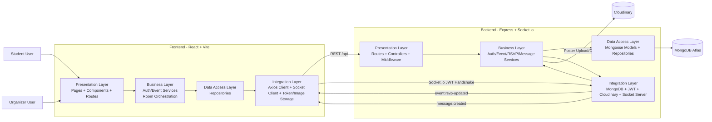

# EventSync Architecture

## Mermaid Diagram

## Layer Summary
- Presentation: pages, forms, controllers, routes, and middleware manage user input and HTTP/socket boundaries.
- Business Logic: services coordinate auth, event ownership, RSVP rules, and event-room messaging.
- Data Access: repositories isolate MongoDB queries and persistence details.
- Integration: third-party concerns such as MongoDB Atlas, Cloudinary, JWT, Axios, and Socket.io stay outside the business core.

## Real-Time Flow
1. A user opens `/events/:eventId` in the frontend.
2. The frontend business service ensures a JWT-authenticated Socket.io connection exists.
3. The client joins room `event:{eventId}`.
4. RSVP changes persist through the REST API, then the backend service emits `event:rsvp-updated`.
5. Chat messages flow through the socket server, are persisted by the message service, and broadcast as `message:created`.
